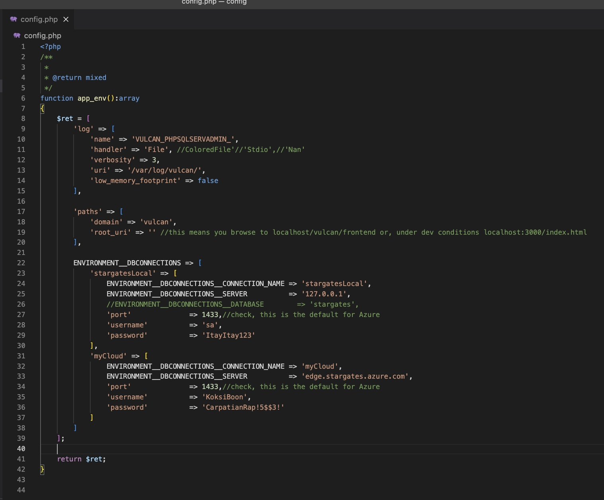
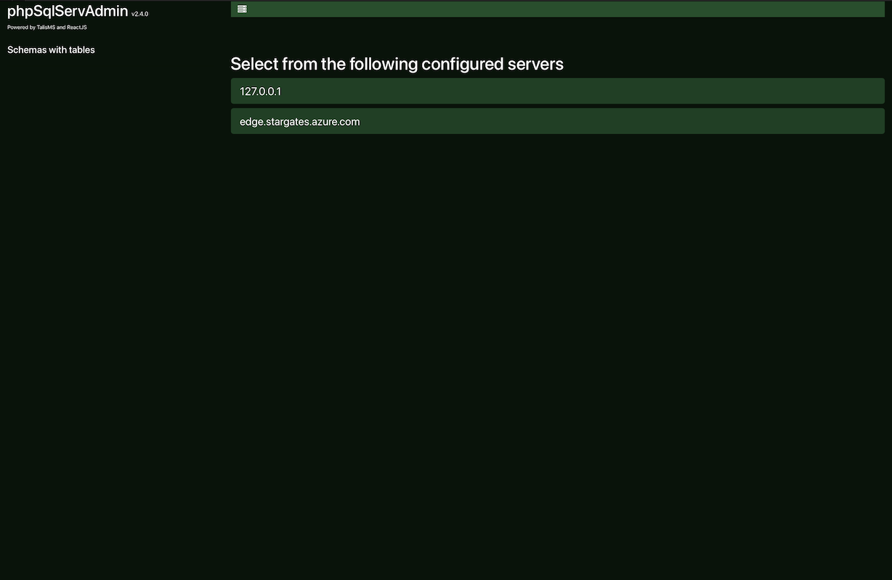
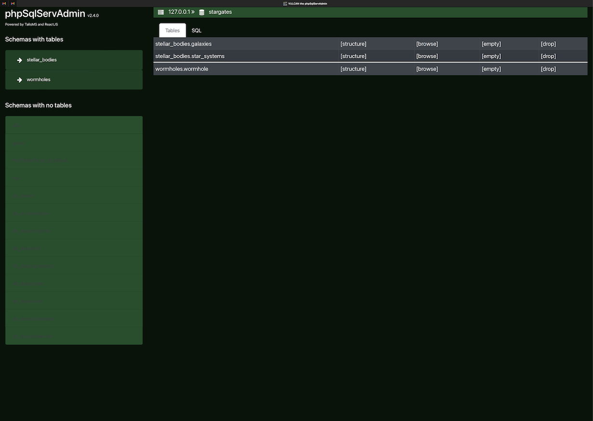
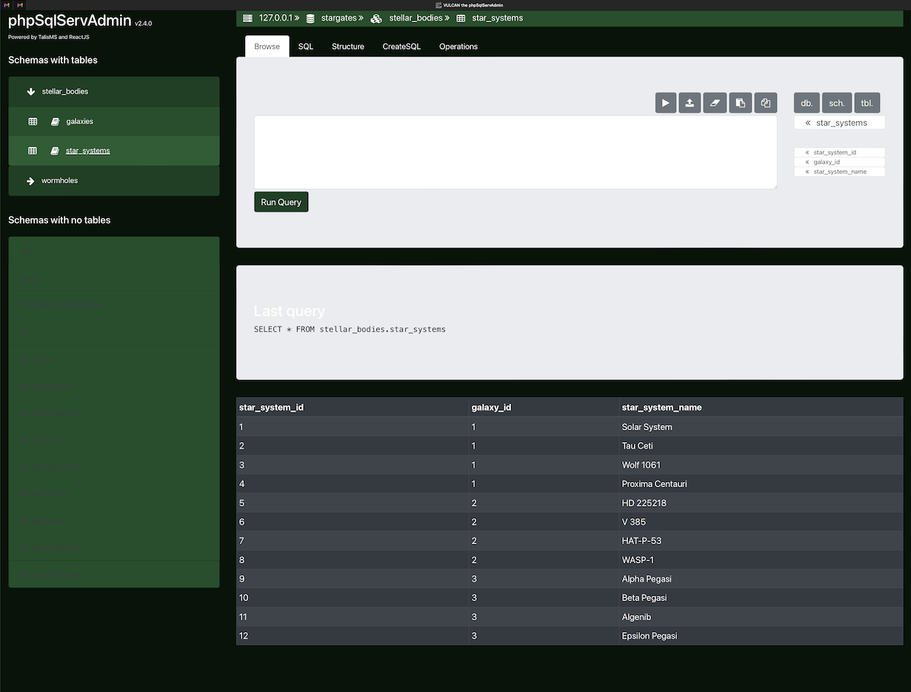
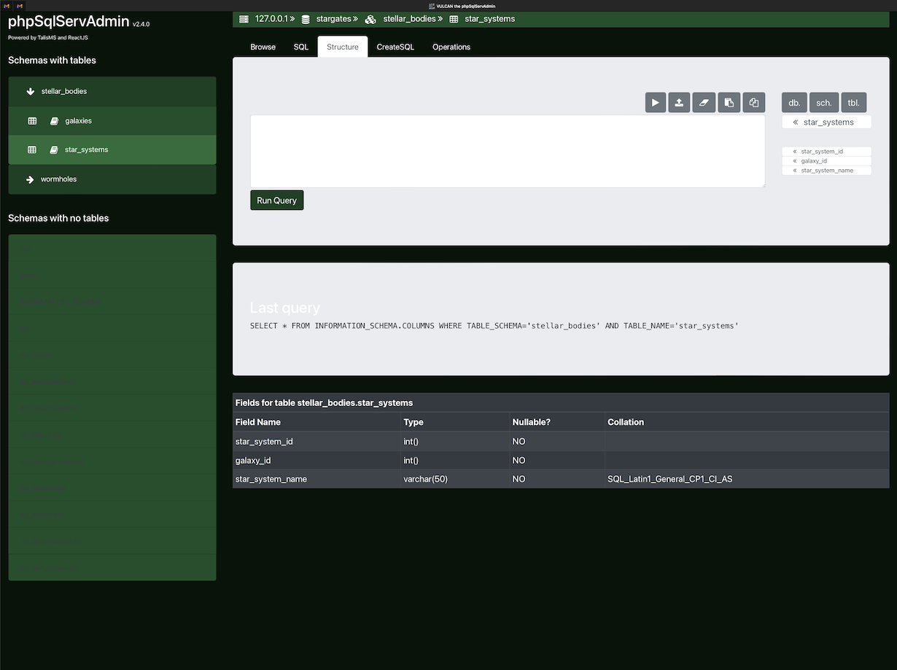
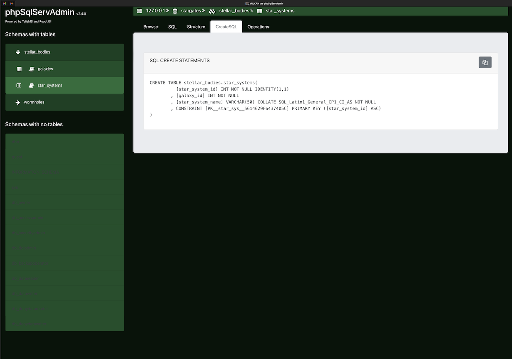
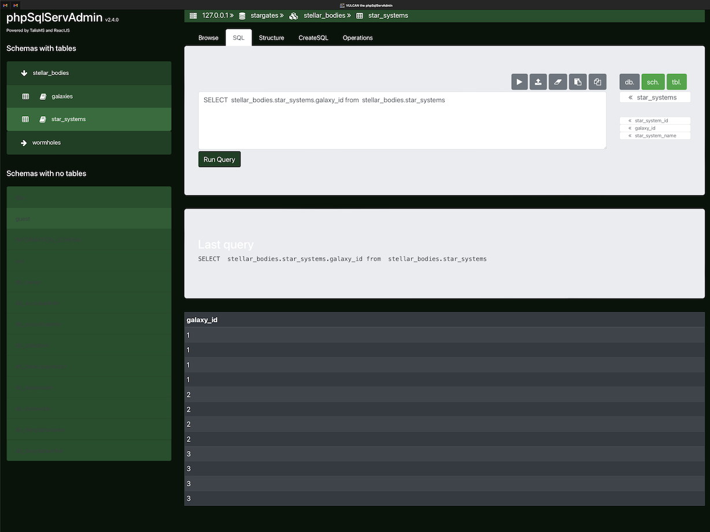
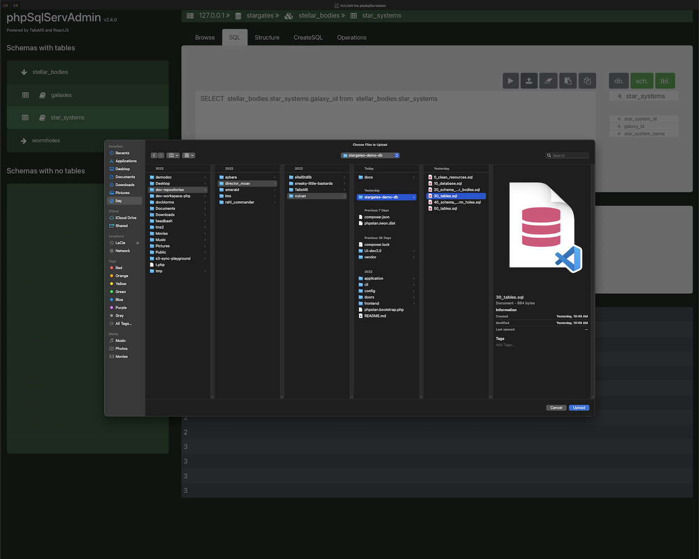

# VULCAN the phpSqlServAdmin
Browser based tool to work with MICROSOFT SQL SERVER from a Linux machine  

NOTICE!
=======

1. This is a tool meant ONLY for development environments. There is no security measures what so ever. You have been warned.
2. It is working but is also under heavy development.  
3. If you wish to install it, feel free to drop me a message and I will be happy to help you install it. Until such time I will have an installation script.
4. This tool was tested connecting to an Azure SQL DATABASE instance only.
5. This tool requires PHP >=7.4 
6. I am not not responsible nor liable to any damage caused to you by this tool. This tool is for DEVELOPMENT purposes only. Never to be used in production.


INSTALL (not yet ready - ping me for help)
==========================================
```
<Directory "/var/www/vulcan/api">
    RewriteRule . index.php [L]
</Directory>
```

## The PHP config


## Select which server you want to work on


## Select the database you want to look at


## Show list of schema and tables in each schema under selected database


## Browse the table data


## See the table structure (fields, indexes, constraints etc)


## See the raw CREATE TABLE statement


## Use the Query Editor with various short cuts and helpers


## Import SQL files into the current database



(50% sized)